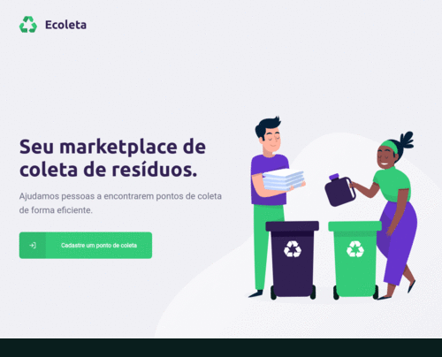
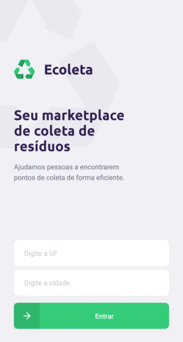

<h1 align="center">
    
</h1>
<h1 align="center">
    &nbsp;&nbsp;&nbsp;
    &nbsp;&nbsp;&nbsp;
    
</h1>

## :eyeglasses: Preview
### :computer: Web

### :iphone: Mobile

## :rocket: Tecnologias
Tecnologias utilizadas no desenvolvimento desse projeto:
* Node.js
* Typescript
* ReactJS
* Raact Native
* Consumo da Api de endereços do IBGE

## Getting Started
~~~
# Clone o repositório para a sua máquina:
$ git clone https://github.com/MichelCassol/ecoleta.git

# Agora configure o IP da sua máquina nos arquivos:
$ /nlw/server/src/controllers/ItemsController.ts
$ /nlw/server/src/controllers/ItemsController.ts

# Após isso abra cada pasta em uma nova sessão de terminal e execute:
$ npm install

# Na pasta server execute:
$ npm run knex:migrate
$ npm run knex:seed

# Por fim execute os comandos de start:
Server: $ npm run dev
Web:    $ npm start
Mobile: $ npm start
~~~

## Licença
Esse projeto está sob a licença MIT. Veja o arquivo [LICENSE](LICENSE) para mais detalhes.